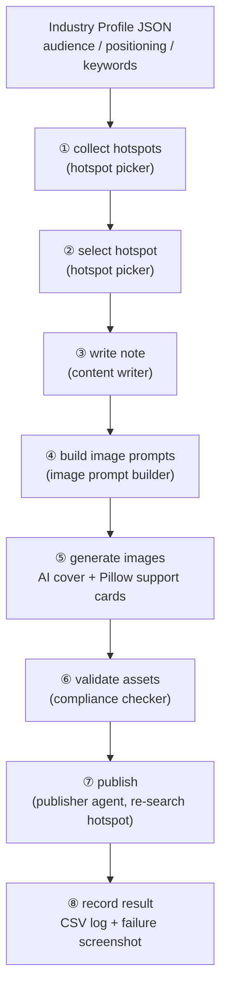

# Douyin Agent Workflow Kit

An **agent-agnostic workflow kit** for AI-powered Douyin (抖音) image-note auto-publishing. Turn the full "hotspot → note → images → publish → log" pipeline into a reusable, industry-configurable workflow that runs inside [OpenClaw](https://github.com/openclaw/openclaw), [Hermes](https://github.com/NousResearch/hermes-agent), Codex, or any agent system that can browse the Douyin Creator Center and call local scripts.

It is **not** another one-off upload script. It is a workflow engineering kit: every stage is a prompt/contract/schema, so you can swap the model, the agent system, the image generator, or the publisher independently.

> 📄 **中文摘要**：一套不绑定特定智能体与模型的抖音图文自动发布工作流——读取实时热点、按行业画像生成图文、AI 直出带字主封面 + Pillow 渲染支撑卡片（统一 3:4 竖版 1080×1440）、发布时重搜热点校验、选不上即停发、BGM 验证歌名+时长、账号凭证零落盘。内置 AI 科普与本地生活餐饮两类行业示例，支持 OpenClaw / Hermes 等 Agent 系统一键迁移部署。


---

## Why this kit

Most Douyin automation repos on GitHub are single-purpose upload scripts (PyAutoGUI / Playwright) that break when the page changes. This kit inverts the problem:

| Typical upload script | This kit |
|---|---|
| Hard-coded flow for one account | Industry profile JSON generalizes to any niche |
| Bound to one agent / model | Prompt + contract per stage, works with OpenClaw / Hermes / Codex |
| Publishes whatever you give it | Validates assets before publishing; **aborts if the hotspot can't be selected** |
| Stores cookies/tokens in config | **Zero credential storage** — manual login, publisher owns its session |
| No image QA | Enforces 3:4 vertical (1080×1440), bans blurred-border/stretched covers |
| Logs in chat | Structured per-post CSV logs, failure screenshots |

## Architecture

Five specialized agents cover eight pipeline stages:



Key reliability rules baked into the pipeline:

- **Hotspot re-verification** — the hotspot is re-searched on the live publish page before selecting; if it is gone, publishing stops instead of forcing it.
- **BGM verification** — a music track counts as selected only when the page shows a title **and** a duration.
- **Credentials** — no passwords, cookies, QR-login data, or browser profiles ever live in the kit.
- **Image QA** — 3:4 vertical enforced, cover text baked in by the image model, support cards rendered deterministically with Pillow.

## Repository layout

```
douyin-agent-workflow-kit/
├── workflow-kit/              # Generic workflow package (docs in Chinese)
│   ├── agent_specs/           # Task specs for OpenClaw / Hermes / generic agents
│   ├── adapters/              # Publisher adapter contracts (social-auto-upload)
│   ├── configs/               # Config examples (account / publisher / workflow)
│   ├── prompts/               # Reusable per-stage prompts (5 agents)
│   ├── templates/project/     # Scaffolded project layout (assets, drafts, logs…)
│   ├── tools/                 # init / validate / demo-images / publish scripts
│   └── workflow/              # Stage definitions & I/O contracts
│
└── industry-skill/            # Industry-configurable agent skill (docs in English)
    ├── SKILL.md               # Main skill: safety rules, workflow, rules
    ├── agents/openai.yaml     # Agent manifest for OpenAI-compatible setups
    ├── examples/              # 2 ready-made industry profiles (AI science, restaurant)
    ├── references/            # content / image / publish / industry-config rules
    └── scripts/               # batch planning, support-card rendering, publish wrapper
```

## Quick start

### Option A — scaffold a new project (workflow-kit)

```bash
# Windows
python workflow-kit/tools/init_project.py --target C:\douyin-ai-project --account-alias my-alias --display-name "My Douyin Name"

# macOS / Linux
python3 workflow-kit/tools/init_project.py --target ~/douyin-ai-project --account-alias my-alias --display-name "My Douyin Name"
```

Then validate a draft and publish one row:

```bash
python workflow-kit/tools/check_note_ready.py --project . --id demo
python workflow-kit/tools/publish_with_sau.py --project . --id demo --social-root /path/to/social-auto-upload
```

See `workflow-kit/INSTALL.md` for the full walkthrough.

### Option B — drop the skill into your agent (industry-skill)

1. Copy `industry-skill/` into your agent's skills directory (or package it however your system loads skills).
2. Provide an industry profile JSON (start from `industry-skill/examples/`).
3. Ask the agent to run the Douyin publishing workflow for your niche.

The full spec is in `industry-skill/SKILL.md`.

## Publisher adapter

Publishing is delegated to a **publisher** through a small contract (`workflow-kit/adapters/social-auto-upload/`), so you can use any automation tool. The reference implementation targets [dreammis/social-auto-upload](https://github.com/dreammis/social-auto-upload) (a 9k+ star multi-platform uploader) via its CLI.

## Related projects / prior art

| Project | What it is |
|---|---|
| [dreammis/social-auto-upload](https://github.com/dreammis/social-auto-upload) | The uploader itself — this kit is a workflow layer on top of it |
| [withwz/douyin_upload](https://github.com/withwz/douyin_upload) | PyAutoGUI upload script |
| Various `douyin-auto-publish` repos | Single-purpose scripts, no workflow/industry abstraction |

This kit's differentiator: the publishing decision chain (hotspot re-search, BGM verification, abort conditions) and the industry-profile abstraction make it usable as a genuine multi-agent workflow, not just a form filler.

## Disclaimer

⚠️ This project is for **educational and technical research purposes only**. Automated publishing may violate Douyin's Terms of Service ("抖音用户服务协议" §5.1 prohibits using automated programs to access the platform). By using this software you agree that:

1. You will comply with the platform's terms and applicable laws; use at your own risk.
2. Any account restriction, ban, or penalty is solely your responsibility.
3. Keep publishing frequency low; this kit intentionally aborts rather than forces publishing when conditions are not met.

The authors are not liable for any consequences of using this software.

## License

MIT © 2026 Finn763 — see [LICENSE](LICENSE).
