<div align="center">

# Douyin Agent Workflow Kit

*Not another upload script. A workflow engineering kit for Douyin publishing.*

[](LICENSE)
[](https://github.com/Finn763/douyin-agent-workflow-kit/stargazers)
[](#install)
[](#how-it-runs)

[中文](README.zh-CN.md) | English

</div>

> Most Douyin automation repos are single-purpose upload scripts that break when the page changes. This kit inverts the problem: every stage is a prompt, a contract, or a schema — swap the model, the agent, the image generator, or the publisher independently.

An **agent-agnostic workflow kit** for AI-powered Douyin (抖音) image-note auto-publishing. Five specialized agents cover eight pipeline stages — hotspot → note → images → publish → log — driven by an industry-profile JSON that generalizes the whole flow to any niche. Runs inside [OpenClaw](https://github.com/openclaw/openclaw), [Hermes](https://github.com/NousResearch/hermes-agent), Codex, or any agent system that can browse the Douyin Creator Center and call local scripts.

---

## How it runs



Profile in on the left, published note plus CSV log on the right. [▶ Interactive version](https://finn763.github.io/douyin-agent-workflow-kit/architecture.html)

1. **Profile** — industry JSON sets audience, positioning, keywords, visual rules (`industry-skill/examples/` has AI-science and restaurant starters).
2. **Hotspots ①②** — search Douyin related-hotspots by keyword, pick real usable ones (`prompts/01_hotspot_picker.md`).
3. **Note ③** — write the copy from a fresh angle per post; same hotspot never means same layout (`02_content_writer.md`).
4. **Images ④⑤** — AI model renders the cover with baked-in Chinese text; Pillow deterministically renders two support cards. All 3:4 vertical, 1080×1440 (`03_image_prompt_builder.md` + `render_support_cards.py`).
5. **Validate ⑥** — compliance checker gates every asset before anything touches the publish page (`04_compliance_checker.md`).
6. **Publish ⑦** — the publisher re-searches the hotspot on the live page; gone means stop, never force (`05_publisher_agent.md` + publisher contract).
7. **Record ⑧** — per-post CSV log plus failure screenshots. Logs live in files, not in chat.

---

## Why this kit

| Typical upload script | This kit |
|---|---|
| Hard-coded flow for one account | Industry profile JSON generalizes to any niche |
| Bound to one agent / model | Prompt + contract per stage, works with OpenClaw / Hermes / Codex |
| Publishes whatever you give it | Validates assets first; **aborts if the hotspot can't be selected** |
| Stores cookies/tokens in config | **Zero credential storage** — manual login, publisher owns its session |
| No image QA | Enforces 3:4 vertical, bans blurred-border/stretched covers |
| Logs in chat | Structured per-post CSV logs, failure screenshots |

Reliability rules baked into the pipeline, not suggested in comments:

- **Hotspot re-verification** — re-searched on the live publish page; gone means stop.
- **BGM verification** — a track counts as selected only with title **and** duration on screen.
- **Cover + upload gates** — all images uploaded, cover confirmed, or nothing ships.
- **Credentials** — no passwords, cookies, QR data, or browser profiles ever live in the kit.

---

## Install

### Option A — scaffold a project (workflow-kit)

```bash
# Windows
python workflow-kit/tools/init_project.py --target C:\douyin-ai-project --account-alias my-alias --display-name "My Douyin Name"

# macOS / Linux
python3 workflow-kit/tools/init_project.py --target ~/douyin-ai-project --account-alias my-alias --display-name "My Douyin Name"
```

Validate a draft, then publish one row:

```bash
python workflow-kit/tools/check_note_ready.py --project . --id demo
python workflow-kit/tools/publish_with_sau.py --project . --id demo --social-root /path/to/social-auto-upload
```

Full walkthrough: `workflow-kit/INSTALL.md`.

### Option B — drop the skill into your agent (industry-skill)

1. Copy `industry-skill/` into your agent's skills directory.
2. Provide an industry profile JSON (start from `industry-skill/examples/`).
3. Ask the agent to run the Douyin publishing workflow for your niche.

Full spec: `industry-skill/SKILL.md`.

---

## What's inside

| | |
|---|---|
| Agents | 5 specialized prompts (hotspot picker, content writer, image prompt builder, compliance checker, publisher) |
| Stages | 8, defined in `workflow-kit/workflow/stages.md` with I/O contracts in `io_contract.md` |
| Publisher | Delegated through a small contract (`adapters/social-auto-upload/`); reference target is [dreammis/social-auto-upload](https://github.com/dreammis/social-auto-upload) CLI |
| Industry packs | 2 ready-made profiles: AI science, local-life restaurant |
| Runtime | None of its own — Python 3.9+ scripts plus whatever agent and publisher you already run |

---

## Repo layout

```
workflow-kit/               # generic workflow package (docs in Chinese)
├── prompts/                # 5 per-stage agent prompts
├── workflow/               # stage definitions + I/O contracts
├── adapters/               # publisher adapter contracts
├── configs/                # account / publisher / workflow examples
├── templates/project/      # scaffolded project layout
├── tools/                  # init / validate / demo-images / publish scripts
└── agent_specs/            # task specs for OpenClaw / Hermes / generic agents
industry-skill/             # industry-configurable agent skill (docs in English)
├── SKILL.md                # safety rules, workflow, content/image/publish rules
├── references/             # content / image / publish / industry-config rules
├── examples/               # 2 industry profiles
└── scripts/                # batch planning, card rendering, publish wrapper
docs/architecture.*         # the diagram above (svg + spec json + interactive html)
```

## Related work

| Project | Relation |
|---|---|
| [dreammis/social-auto-upload](https://github.com/dreammis/social-auto-upload) | The uploader itself — this kit is a workflow layer on top of it |
| [withwz/douyin_upload](https://github.com/withwz/douyin_upload) | PyAutoGUI upload script, no workflow abstraction |

## Disclaimer

⚠️ For **educational and technical research purposes only**. Automated publishing may violate Douyin's Terms of Service ("抖音用户服务协议" §5.1 prohibits automated access). By using this software you agree that you comply with platform terms and applicable laws at your own risk; any restriction, ban, or penalty is solely your responsibility; and you keep publishing frequency low — this kit aborts rather than forces publishing when conditions are not met. The authors are not liable for any consequences.

## License

[MIT](LICENSE) © 2026 Finn763
