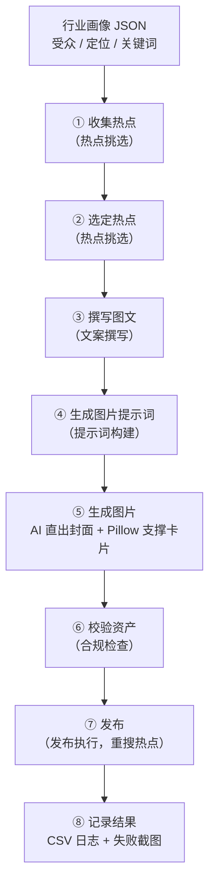

# 抖音智能体工作流包（Douyin Agent Workflow Kit）

一套**不绑定特定智能体与模型**的抖音（Douyin）图文自动发布工作流包。把「热点 → 图文 → 图片 → 发布 → 日志」完整链路做成可复用、可按行业配置的工作流，可运行在 [OpenClaw](https://github.com/openclaw/openclaw)、[Hermes](https://github.com/NousResearch/hermes-agent)、Codex 或任何能浏览抖音创作者中心、调用本地脚本的智能体系统中。

它**不是**又一个一次性上传脚本，而是一个工作流工程套件：每个阶段都是独立的提示词/契约/数据模式，模型、智能体系统、图片生成器、发布器都可以任意替换。

> 📄 English version: [README.md](README.md)


---

## 为什么做这套包

GitHub 上大多数抖音自动化仓库是单一用途的上传脚本（PyAutoGUI / Playwright），页面一改版就失效。这套包把问题反过来解：

| 常见的上传脚本 | 这套工作流包 |
|---|---|
| 为一个账号硬编码流程 | 行业画像 JSON 泛化到任意赛道 |
| 绑定某一种智能体/模型 | 每阶段一个提示词+契约，OpenClaw / Hermes / Codex 通用 |
| 给什么发什么 | 发布前校验资产；**热点选不上就中止，不强发** |
| 配置里存 cookie/token | **凭证零落盘**——人工登录，会话由发布器自己管理 |
| 不检查图片质量 | 强制 3:4 竖版（1080×1440），禁止模糊边/拉伸底图 |
| 日志打在聊天里 | 结构化 CSV 逐条日志 + 失败截图留档 |

## 架构

五个专职智能体覆盖八个流水线阶段：



写死在流程里的可靠性规则：

- **热点二次校验**——每次发布前在真实发布页重搜热点，搜不到就停发，绝不硬发
- **BGM 验证**——音乐必须在页面上同时显示歌名**和**时长才算选中
- **凭证安全**——密码、cookie、扫码信息、浏览器配置一律不进包
- **图片质检**——3:4 竖版强制校验，封面文字由图片模型直接生成，支撑卡片用 Pillow 确定性渲染

## 仓库结构

```
douyin-agent-workflow-kit/
├── workflow-kit/              # 通用工作流包（中文文档）
│   ├── agent_specs/           # OpenClaw / Hermes / 通用智能体的任务说明
│   ├── adapters/              # 发布器适配契约（social-auto-upload）
│   ├── configs/               # 配置示例（账号 / 发布器 / 工作流）
│   ├── prompts/               # 分阶段可复用提示词（5 个智能体）
│   ├── templates/project/     # 脚手架项目布局（素材、草稿、日志…）
│   ├── tools/                 # 初始化 / 校验 / 演示图 / 发布脚本
│   └── workflow/              # 阶段定义与输入输出契约
│
└── industry-skill/            # 行业可配置 Skill（英文文档）
    ├── SKILL.md               # 主 Skill：安全规则、工作流、各类规则
    ├── agents/openai.yaml     # OpenAI 兼容体系的智能体清单
    ├── examples/              # 2 个现成行业画像（AI 科普、餐饮）
    ├── references/            # 内容 / 图片 / 发布 / 行业配置规则
    └── scripts/               # 批量排期、支撑卡片渲染、发布封装
```

## 快速开始

### 方式 A——脚手架一个新项目（workflow-kit）

```bash
# Windows
python workflow-kit/tools/init_project.py --target C:\douyin-ai-project --account-alias my-alias --display-name "我的抖音昵称"

# macOS / Linux
python3 workflow-kit/tools/init_project.py --target ~/douyin-ai-project --account-alias my-alias --display-name "我的抖音昵称"
```

校验草稿、发布一条排期：

```bash
python workflow-kit/tools/check_note_ready.py --project . --id demo
python workflow-kit/tools/publish_with_sau.py --project . --id demo --social-root /path/to/social-auto-upload
```

完整流程见 `workflow-kit/INSTALL.md`。

### 方式 B——把 Skill 装进你的智能体（industry-skill）

1. 把 `industry-skill/` 复制进你的智能体 skills 目录（按你所用系统的加载方式打包）。
2. 准备一份行业画像 JSON（可从 `industry-skill/examples/` 直接改）。
3. 让智能体按画像执行抖音发布工作流。

完整规范见 `industry-skill/SKILL.md`。

## 发布器适配

发布动作通过一个小契约（`workflow-kit/adapters/social-auto-upload/`）委托给**发布器**执行，因此可以对接任意自动化工具。参考实现面向 [dreammis/social-auto-upload](https://github.com/dreammis/social-auto-upload)（9k+ star 的多平台上传器）的 CLI。

## 相关项目 / 前人工作

| 项目 | 定位 |
|---|---|
| [dreammis/social-auto-upload](https://github.com/dreammis/social-auto-upload) | 上传器本体——本包是它之上的工作流层 |
| [withwz/douyin_upload](https://github.com/withwz/douyin_upload) | PyAutoGUI 上传脚本 |
| 各类 `douyin-auto-publish` 仓库 | 单一用途脚本，无工作流/行业抽象 |

本包的差异化：发布决策链（热点重搜、BGM 验证、中止条件）+ 行业画像抽象，让它能作为真正的多智能体工作流使用，而不只是填表工具。

## 免责声明

⚠️ 本项目**仅供学习与技术研究用途**。自动化发布可能违反抖音平台用户协议（《抖音用户服务协议》5.1 条禁止使用自动化程序接入平台）。使用本软件即表示你同意：

1. 遵守平台规则与适用法律，使用风险自担；
2. 账号被限流、封禁或处罚等一切后果由使用者自行承担；
3. 控制发布频率；本包在条件不满足时会主动中止发布，而非强行发布。

作者不对使用本软件产生的任何后果负责。

## 许可证

MIT © 2026 Finn763 —— 详见 [LICENSE](LICENSE)。
